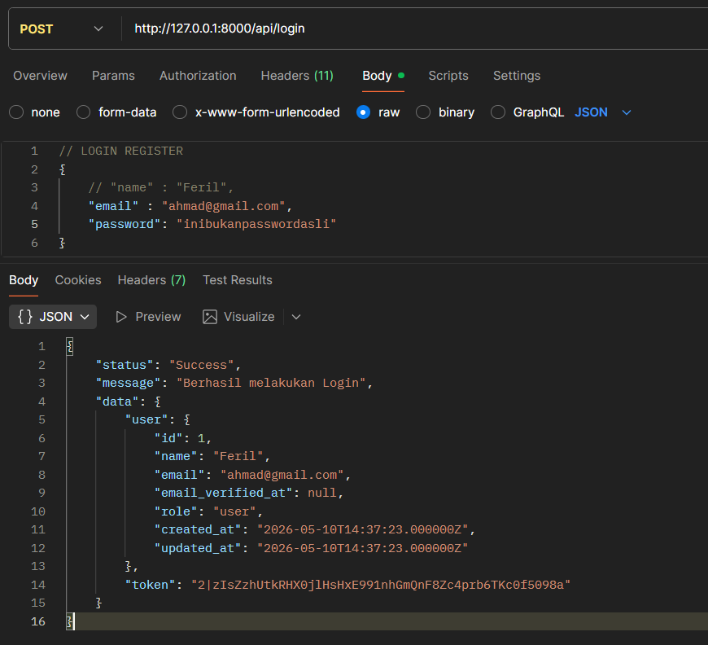
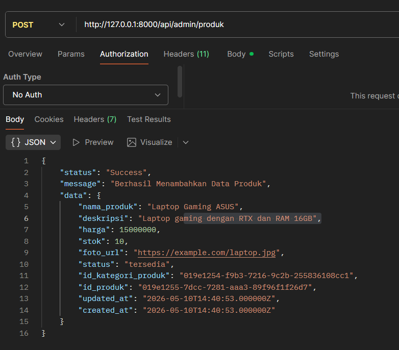
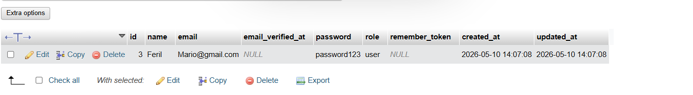

# 🔐 TokoHebat - Security Study Case

TokoHebat adalah toko online kecil yang jual berbagai produk lokal. Backend-nya dibangun pakai Laravel oleh seorang freelancer bernama Yoga sekitar empat bulan lalu. Setelah selesai, Yoga langsung ke proyek lain — dan tidak ada yang merawat kodenya.

Bulan ini, pemilik toko mempekerjakan kamu sebagai developer in-house pertama mereka. Di hari pertama kerja, belum sempat kamu baca dokumentasi, HP kamu sudah berbunyi.

> 😟  
> “Mas, ada pelanggan komplain bisa login pakai email orang lain! Katanya dia coba-coba iseng, ternyata bisa masuk ke akun orang.”



---

> 🤯  
> “Ini juga — ada yang lapor bisa akses halaman admin padahal dia cuma user biasa. Cuma ganti angka di URL katanya.”



---

> 😵  
> “Password pelanggan kita juga kayaknya tersimpan apa adanya di database. Aku lihat sendiri waktu buka tabel users tadi.”



---

Kamu buka laptop, tarik napas, dan mulai clone repo TokoHebat.

> *“Yoga bilang semuanya sudah aman. Tapi kayaknya definisi aman kita berbeda...”*  
> — gumam kamu sambil scroll kode.

---

# ✅ Branch Solusi

Branch solusi tersedia di bawah ini:
https://github.com/Yohnzz/TokoHebat/tree/codemario
```bash
git checkout codemario