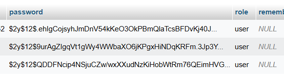
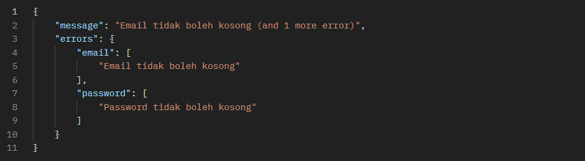
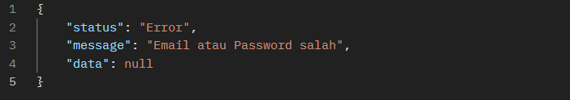
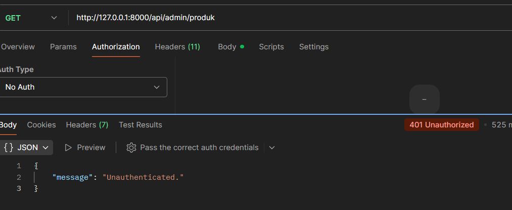

# TokoHebat - Security Fix Implementation 🚀

Selamat datang di repository **TokoHebat**. Repository ini berisi perbaikan keamanan menyeluruh dari sistem backend Laravel yang sebelumnya memiliki celah keamanan kritis.

---

## 📝 Kasus Studi: "Definisi Aman yang Berbeda"

Project ini awalnya dikerjakan oleh seorang freelancer (Yoga) dengan beberapa masalah keamanan serius yang ditemukan :
1. **Broken Authentication**: User bisa login hanya dengan email tanpa verifikasi password yang benar.
2. **Plain-Text Passwords**: Data password pelanggan disimpan tanpa enkripsi (hashing).
3. **Broken Access Control**: Halaman admin (`/admin/*`) dapat diakses oleh siapa saja tanpa login atau pengecekan role.
4. **Insecure Authorization**: User biasa dapat mengakses fitur admin hanya dengan mengubah URL.

---

## 🛠️ Solusi & Perbaikan

Berikut adalah langkah-langkah teknis yang telah diimplementasikan di branch `codemario` untuk menutup celah tersebut:

### 1. Keamanan Password (Hashing)
**Masalah:** Password disimpan langsung apa adanya.
**Solusi:** Mengimplementasikan `bcrypt` hashing pada saat registrasi user.
- **File:** `app/Handler/AuthHandler.php`
- **Perubahan:**
  ```php
  'password' => bcrypt($request->password),
  ```



### 2. Verifikasi Login yang Ketat
**Masalah:** Hanya mengecek keberadaan email.
**Solusi:** Menambahkan validasi password menggunakan `Hash::check()`.
- **File:** `app/Handler/AuthHandler.php`
- **Perubahan:**
  ```php
  if(!$user || !Hash::check($request->password, $user->password)){
      return null;
  }
  ```
  



### 3. Middleware Role-Based Access Control (RBAC)
**Masalah:** Tidak ada pemisahan hak akses antara `admin` dan `user`.
**Solusi:** Membuat `RoleMiddleware` kustom untuk mengecek role user sebelum mengizinkan akses ke rute tertentu.
- **File Middleware:** `app/Http/Middleware/RoleMiddleware.php`
- **Registrasi:** `bootstrap/app.php` (Alias: `role`)

### 4. Proteksi Rute (Route Protection)
**Masalah:** Rute admin terbuka untuk publik.
**Solusi:** Mengelompokkan rute admin dan melindunginya dengan middleware `auth:sanctum` dan `role:admin`.
- **File:** `routes/api.php`
- **Perubahan:**
  ```php
  Route::prefix('admin')->middleware(['auth:sanctum', 'role:admin'])->group(function(){
      Route::apiResource('/kategori', KategoriController::class);
      Route::apiResource('/produk', ProdukController::class);
  });
  ```


---

## 🚀 Cara Menjalankan Project

1. **Clone Repository**
   ```bash
   git clone https://github.com/Yohnzz/TokoHebat.git
   cd TokoHebat
   ```

2. **Pindah ke Branch Solusi**
   ```bash
   git checkout codemario
   ```

3. **Install Dependencies**
   ```bash
   composer install
   ```

4. **Setup Environment**
   ```bash
   cp .env.example .env
   php artisan key:generate
   ```

5. **Migrate & Seed** (Jika ada seeder)
   ```bash
   php artisan migrate
   ```

6. **Jalankan Server**
   ```bash
   php artisan serve
   ```

---

## 👨‍💻 Kontributor
**Mario** - Developer In-House TokoHebat

---
*Catatan: Pastikan untuk menambahkan gambar pendukung di folder `assets/` sesuai dengan placeholder yang disediakan di atas agar dokumentasi lebih informatif.*